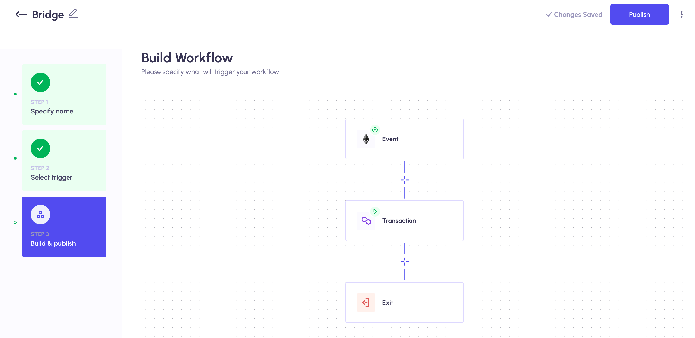

# Nerif Bridge

Nerif Bridge is the decentralized cross-chain bridge powered by [Nerif Network](https://nerif.network).


**DO NOT USE FOR PRODUCTION PURPOSES.** 
This bridge setup does not have a proper security mechanisms, billing, and many other things that are needed for production use.
The current state of Nerif Bridge shows high level overview of the bridging architecture using [Nerif Network](https://nerif.network) and can be used for demo only.

## Set up

Bootstrapping the Nerif Bridge requires deploying several smart contracts and creating a special workflow within Nerif Network in order to power the bridge.

Bridge contracts deployment requires having [Gateway](https://github.com/nerifnetwork/contracts/blob/main/contracts/operational/Gateway.sol) contract already deployed and registered per [Registry](https://github.com/nerifnetwork/contracts/blob/main/contracts/operational/Registry.sol#L244) on all chains.

### Initialize environment

First aff all, run the following command in order to create all required environment files:

```bash
$ make init
```

As a results, the following files will be created: .env, contracts-5.json, contracts-80001.json, contracts-97.json, contracts-10200.json.
Replace gateway address for the real one in those .json files. Specify real values in .env file.

Now the bridge contracts can be deployed:

```bash
$ VERIFY=true make deploy-bridge
```

As a result, [the bridge contract](./contracts/bridge/NerifBridge.sol) will be deployed on Goerli (5), Mumbai (80001), BSC Testnet (97), and Gnosis Chiado (10200) chains.
Addresses are stored in those .json filed in the root of the repo.

### Create Nerif Network workflow

Use the official tutorial for creating a Bridge: https://docs.nerif.network/3.-how-it-works/tutorials/bridge-tutorial



### Test

There is [the test receiver contract](./contracts/test/TestReceiver.sol) that can be deployed on those chains.

The following command deploys this contract on the Mumbai (80001) chain:

```bash
$ VERIFY=true make deploy-receiver
```

Test receiver contract address is stored in the contracts-80001.json file.

Now, the first test message can be sent be executing `send` function within the bridge contract deployed on goerli.
It can be done in many ways, but there is a command for sending a test message:

```bash
$ make send-message
```
